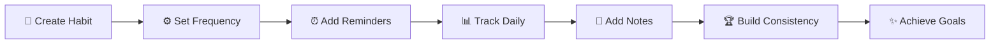
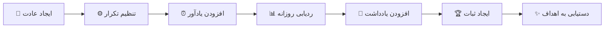

<div align="center">

# 🎯 Routica

### *Build better habits, one day at a time.*


**A powerful yet intuitive habit tracking app that transforms your daily routines into lasting success**

[Features](#-features) • [Use Cases](#-use-cases) • [How It Works](#-how-it-works) • [Get Started](#-start-your-journey)

---

</div>

## 🌟 Why Routica?

<table>
<tr>
<td width="33%" align="center">

<h3>Smart & Flexible</h3>
Not all habits are equal. Adapt to your lifestyle with daily, weekly, monthly, or custom intervals.
</td>
<td width="33%" align="center">

<h3>Beautiful & Personal</h3>
Choose from vibrant colors and icons. Make your tracker as motivating as your goals.
</td>
<td width="33%" align="center">

<h3>Insightful</h3>
Track progress, build streaks, understand patterns. Add notes to remember your journey.
</td>
</tr>
</table>

---

## ✨ Features

### 📅 **Flexible Frequency Options**

| Frequency Type | Description | Example |
|:--------------|:-----------|:--------|
| 🌞 **Daily** | Every single day | Meditation, Water intake |
| 📆 **Weekly** | X times per week | Gym 3x/week |
| 🗓️ **Monthly** | X times per month | Read 4 books/month |
| 🔄 **Custom** | Every X days | Journaling every 3 days |
| 📍 **Specific Days** | Choose exact weekdays | Mon/Wed/Fri workouts |

### ⏰ **Smart Reminders**

> 🔔 Never forget your habits with intelligent notifications

- ✅ Multiple reminder times per habit
- ✅ Daily, weekdays, weekends, or one-time patterns
- ✅ Perfect timing for morning, afternoon, and evening routines

### 📊 **Complete Tracking System**

```
✓ Done    → Mark completed habits
⊘ Skip    → Conscious breaks
✗ Miss    → Honest tracking
📈 History → Complete progress view
```

### 📝 **Daily Notes & Reflections**

- 💭 Add context to your journey (up to 500 characters)
- 🎉 Celebrate your wins
- 🤔 Understand what works
- 💡 Learn from your patterns

### 🎨 **Visual Customization**

<div align="center">

🎨 **Icons** | 🌈 **Colors** | ✨ **Themes**
:---:|:---:|:---:
Wide range | Hex codes | Personalized

</div>

---

## 💡 Use Cases

<details>
<summary>🏃‍♂️ <b>Health & Fitness</b></summary>

- Daily workouts
- Water intake tracking
- Vitamins & supplements
- Stretching routines
- Sleep schedule
- Meal planning

</details>

<details>
<summary>🚀 <b>Productivity</b></summary>

- Daily writing
- Inbox zero
- Focused work sessions
- Learning time
- Project milestones
- Code commits

</details>

<details>
<summary>🧘 <b>Mindfulness</b></summary>

- Meditation practice
- Gratitude journaling
- Breathing exercises
- Digital detox
- Mindful eating
- Nature walks

</details>

<details>
<summary>📚 <b>Personal Growth</b></summary>

- Reading daily
- Language learning
- Musical practice
- Skill development
- Online courses
- Creative projects

</details>

<details>
<summary>💆 <b>Self-Care</b></summary>

- Skincare routine
- Phone-free time
- Social connections
- Hobbies & fun
- Rest days
- Me-time activities

</details>

<details>
<summary>🏠 <b>Home & Life</b></summary>

- Cleaning schedule
- Meal prep
- Plant care
- Budgeting
- Decluttering
- Home maintenance

</details>

---

## 🎯 How It Works

<div align="center">



</div>

### Step-by-Step Guide

| Step | Action | Description |
|:----:|:-------|:-----------|
| **1** | 🎨 **Create** | Name your habit, pick an icon and color |
| **2** | ⚙️ **Configure** | Set how often (daily, weekly, custom) |
| **3** | ⏰ **Remind** | Add notification times |
| **4** | 📊 **Track** | Mark done, skip, or miss daily |
| **5** | 📝 **Reflect** | Add notes about your experience |
| **6** | 🏆 **Succeed** | Build consistency over time |

---

## 🚀 Start Your Journey

> 💪 Building habits isn't about perfection—it's about progress.

<div align="center">

### **Routica helps you show up consistently, understand your patterns, and celebrate your wins along the way.**

🌱 Every journey begins with a single step. Make it count with Routica.

---

### ⭐ **Star this repo if you believe in building better habits!**

</div>

---

## 📸 Screenshots

*Coming soon...*

---

## 🛠️ Tech Stack

- Modern architecture
- Efficient data structure
- JSON schema validation
- Timestamp tracking
- Flexible configuration system

---

## 📄 License

This project is licensed under the MIT License.

---

## 🤝 Contributing

Contributions, issues, and feature requests are welcome!

Feel free to check the [issues page](../../issues).

---

## 💖 Show Your Support

Give a ⭐ if this project helped you build better habits!

---

<div align="center">

**Made with ❤️ and lots of ☕**

</div>

---
---

<div align="center" dir="rtl">

# 🎯 Routica

### *عادت‌های بهتر بساز، یک روز در یک زمان*


**یک برنامه قدرتمند و ساده برای ردیابی عادت‌ها که روتین‌های روزانه شما را به موفقیت پایدار تبدیل می‌کند**

[ویژگی‌ها](#-ویژگی‌ها) • [کاربردها](#-کاربردها) • [نحوه کار](#-نحوه-کار) • [شروع کنید](#-سفر-خود-را-شروع-کنید)

---

</div>

<div dir="rtl">

## 🌟 چرا Routica؟

<table>
<tr>
<td width="33%" align="center">

<h3>هوشمند و انعطاف‌پذیر</h3>
همه عادت‌ها یکسان نیستند. با فواصل روزانه، هفتگی، ماهانه یا سفارشی خود را با سبک زندگی‌تان تطبیق دهید.
</td>
<td width="33%" align="center">

<h3>زیبا و شخصی</h3>
از میان رنگ‌ها و آیکون‌های پرجنب‌وجوش انتخاب کنید. ردیاب خود را به اندازه اهدافتان انگیزه‌بخش کنید.
</td>
<td width="33%" align="center">

<h3>بینش‌آور</h3>
پیشرفت را دنبال کنید، زنجیره‌های موفقیت بسازید، الگوها را درک کنید. یادداشت اضافه کنید تا سفرتان را به یاد بیاورید.
</td>
</tr>
</table>

---

## ✨ ویژگی‌ها

### 📅 **گزینه‌های انعطاف‌پذیر تکرار**

| نوع تکرار | توضیحات | مثال |
|:---------|:-------|:-----|
| 🌞 **روزانه** | هر روز | مدیتیشن، نوشیدن آب |
| 📆 **هفتگی** | X بار در هفته | باشگاه 3 بار در هفته |
| 🗓️ **ماهانه** | X بار در ماه | 4 کتاب در ماه |
| 🔄 **سفارشی** | هر X روز | ژورنال نویسی هر 3 روز |
| 📍 **روزهای خاص** | انتخاب دقیق روزهای هفته | ورزش دوشنبه/چهارشنبه/جمعه |

### ⏰ **یادآورهای هوشمند**

> 🔔 با اعلان‌های هوشمند هرگز عادت‌های خود را فراموش نکنید

- ✅ چندین زمان یادآوری برای هر عادت
- ✅ الگوهای روزانه، روزهای کاری، آخر هفته یا یک‌بار
- ✅ زمان‌بندی عالی برای روتین‌های صبح، بعدازظهر و شب

### 📊 **سیستم ردیابی کامل**

```
✓ انجام شد → عادت‌های تکمیل شده را علامت بزنید
⊘ رد شد   → استراحت‌های آگاهانه
✗ از دست رفت → ردیابی صادقانه
📈 تاریخچه → نمای کامل پیشرفت
```

### 📝 **یادداشت‌ها و تأملات روزانه**

- 💭 زمینه را به سفر خود اضافه کنید (تا 500 کاراکتر)
- 🎉 پیروزی‌های خود را جشن بگیرید
- 🤔 بفهمید چه چیزی کارساز است
- 💡 از الگوهای خود یاد بگیرید

### 🎨 **سفارشی‌سازی بصری**

<div align="center">

🎨 **آیکون‌ها** | 🌈 **رنگ‌ها** | ✨ **تم‌ها**
:---:|:---:|:---:
طیف وسیع | کدهای رنگی | شخصی‌سازی شده

</div>

---

## 💡 کاربردها

<details>
<summary>🏃‍♂️ <b>سلامت و تناسب اندام</b></summary>

- ورزش روزانه
- ردیابی نوشیدن آب
- ویتامین‌ها و مکمل‌ها
- روتین کشش
- برنامه خواب
- برنامه‌ریزی غذا

</details>

<details>
<summary>🚀 <b>بهره‌وری</b></summary>

- نوشتن روزانه
- صندوق ورودی خالی
- جلسات کار متمرکز
- زمان یادگیری
- نقاط عطف پروژه
- کامیت‌های کد

</details>

<details>
<summary>🧘 <b>ذهن‌آگاهی</b></summary>

- تمرین مدیتیشن
- ژورنال قدردانی
- تمرین‌های تنفسی
- دیتاکس دیجیتال
- خوردن آگاهانه
- پیاده‌روی در طبیعت

</details>

<details>
<summary>📚 <b>رشد شخصی</b></summary>

- خواندن روزانه
- یادگیری زبان
- تمرین موسیقی
- توسعه مهارت
- دوره‌های آنلاین
- پروژه‌های خلاقانه

</details>

<details>
<summary>💆 <b>مراقبت از خود</b></summary>

- روتین مراقبت از پوست
- زمان بدون تلفن
- ارتباطات اجتماعی
- سرگرمی و لذت
- روزهای استراحت
- فعالیت‌های شخصی

</details>

<details>
<summary>🏠 <b>خانه و زندگی</b></summary>

- برنامه نظافت
- آماده‌سازی غذا
- مراقبت از گیاهان
- بودجه‌بندی
- مرتب‌سازی
- نگهداری خانه

</details>

---

## 🎯 نحوه کار

<div align="center">



</div>

### راهنمای گام‌به‌گام

| گام | عمل | توضیحات |
|:---:|:---|:--------|
| **۱** | 🎨 **ایجاد** | عادت را نام‌گذاری کنید، آیکون و رنگ انتخاب کنید |
| **۲** | ⚙️ **پیکربندی** | تعیین کنید چند وقت یک‌بار (روزانه، هفتگی، سفارشی) |
| **۳** | ⏰ **یادآوری** | زمان‌های اعلان را اضافه کنید |
| **۴** | 📊 **ردیابی** | انجام شد، رد شد یا از دست رفت را روزانه علامت بزنید |
| **۵** | 📝 **تأمل** | یادداشتی درباره تجربه‌تان اضافه کنید |
| **۶** | 🏆 **موفقیت** | در طول زمان ثبات بسازید |

---

## 🚀 سفر خود را شروع کنید

> 💪 ساختن عادت درباره کمال نیست—درباره پیشرفت است.

<div align="center">

### **Routica به شما کمک می‌کند به طور مداوم حاضر شوید، الگوهای خود را درک کنید و پیروزی‌هایتان را جشن بگیرید.**

🌱 هر سفری با یک قدم شروع می‌شود. آن را با Routica ارزشمند کنید.

---

### ⭐ **اگر به ساختن عادت‌های بهتر اعتقاد دارید، به این مخزن ستاره بدهید!**

</div>

---

## 📸 تصاویر

*به زودی...*

---

## 🛠️ فناوری‌های استفاده شده

- معماری مدرن
- ساختار داده کارآمد
- اعتبارسنجی JSON schema
- ردیابی برچسب زمانی
- سیستم پیکربندی انعطاف‌پذیر

---

## 📄 مجوز

این پروژه تحت مجوز MIT منتشر شده است.

---

## 🤝 مشارکت

مشارکت‌ها، مشکلات و درخواست‌های ویژگی خوشامد است!

لطفاً [صفحه مشکلات](../../issues) را بررسی کنید.

---

## 💖 حمایت خود را نشان دهید

اگر این پروژه به شما در ساختن عادت‌های بهتر کمک کرد، یک ⭐ بدهید!

---

<div align="center">

**ساخته شده با ❤️ و مقدار زیادی ☕**

</div>

</div>
